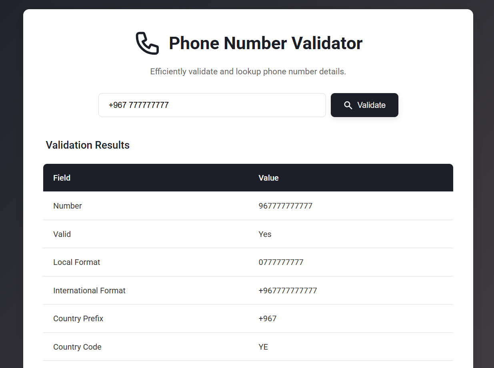

# Phone Number Validator

A clean and efficient web application for validating and looking up details of phone numbers using the Numlookupapi.

 

## Table of Contents
- [About the Project](#about-the-project)
- [Features](#features)
- [Installation](#installation)


## About the Project
This project provides a simple, formal, and user-friendly interface to validate phone numbers and retrieve associated details such as country, location, carrier, and line type. It leverages the Numlookupapi for its backend data. Designed with a clean aesthetic, it offers a professional tool for quick phone number information retrieval.

## Features
- **Phone Number Validation**: Checks if a given phone number is valid
- **Detailed Lookup**: Retrieves comprehensive information including:
  - Number (E.164, local, international formats)
  - Country Code and Name
  - Geographic Location
  - Carrier Information
  - Line Type (mobile, landline, VoIP)
  - Rechargeable status
- **Intuitive User Interface**: Clean, responsive design for ease of use on various devices
- **Real-time Status Updates**: Provides feedback during search operations
- **Error Handling**: Displays clear messages for API errors or invalid inputs

### Installation
- Go to Numlookupapi.com and sign up for an account
- Get your API key from the dashboard
- Replace with your actual API key in js file
```bash
const API_KEY = "YOUR_ACTUAL_API_KEY_HERE";
